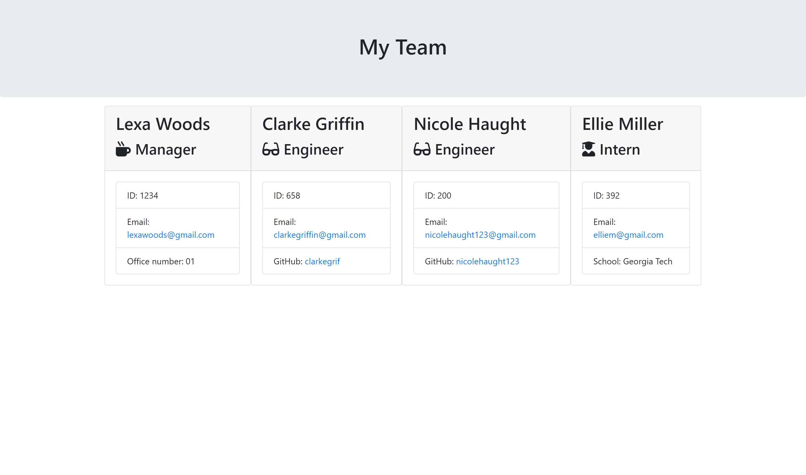

# Team Generator

## DESCRIPTION

This project is great for managers who need to keep track of their employees and their emails and GitHub usernames! With the Team Generator, you can add each of your managers, engineers, and interns and whatever the specific job title questions ask of you. So go ahead and give it shot and keep track of your employees!

## TABLE OF CONTENTS

\*[Installation](#Installation)

\*[Usage](#Usage)

\*[License](#License)

\*[Contributing](#Contributing)

\*[Tests](#Tests)

\*[Questions](#Questions)

## LAYOUT

Here's what the application looks like!

## INSTALLATION

Simply type in "node app.js" and the questions will begin! Follow them and when you are complete, the html will generate and your employees will show up seperately and organized!

## USAGE

As mentioned already, this application is used to keep track of employees of a company/work force.

## LICENSE

Copyright (c) [2020] [JamieJones]

This application is licensed under the MIT license.

Find out more about the license here:

(https://opensource.org/licenses/MIT)

## CONTRIBUTING

Thank you to my fellow classmates of the WebDev Bootcamp!

## TESTS

All the user needs to do is answer the questions and open the html file when it is generated.

## QUESTIONS

For any questions, contact me:

Github: https://www.github.com/jamjon94

email: jamie.mar.jones14@gmail.com
